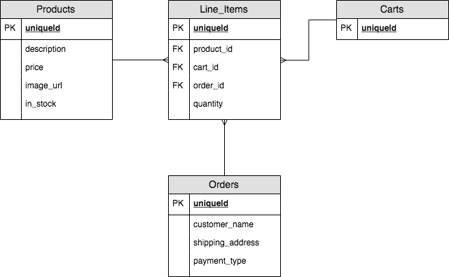

# Node Shopping Cart Example App

Basic implementation of shopping cart model logic using Node Express and in-memory model and DB.

A user should be able to:
- view and add products to a cart
- add and remove product items from the cart
- checkout the cart and add order details

A simple relational database model could be as follows:



App setup as follows
```shell
db // database persistence layer
  L DB.js // temp stored in memory
  L mongodb.js // TODO: add mongodb connection

model // CRUD and validation to DB
  L validation // validate data before being written to DB (use JOI helper)
  LineItem.js // CRUD functions
  Product.js // CRUD functions

controller // API between interface and model. Responsible for serialization and any other logic required that is not specifcally related to direct CRUD operations
  L serializers // serialize data appropriate for model
  products.js // product controller

webserver // Web interface
  L routes // Express routes
  server.js // Express application

util // Shared util helpers
  L wrapper.js // wrap async await functions to fail safely
```

### TODO:
- [x] Architecture
- [x] Model validation with JOI
- [x] Products CRUD
- [x] Line_Items CRUD
- [x] Carts CRUD
- [x] Web interface - Products Index
- [x] Web interface - Cart (add and remove items)
- [ ] Web sessions for Cart
- [ ] Orders CRUD
- [ ] Web interface - Orders checkout

